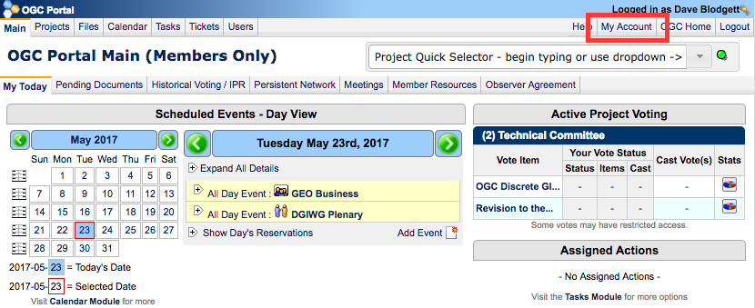
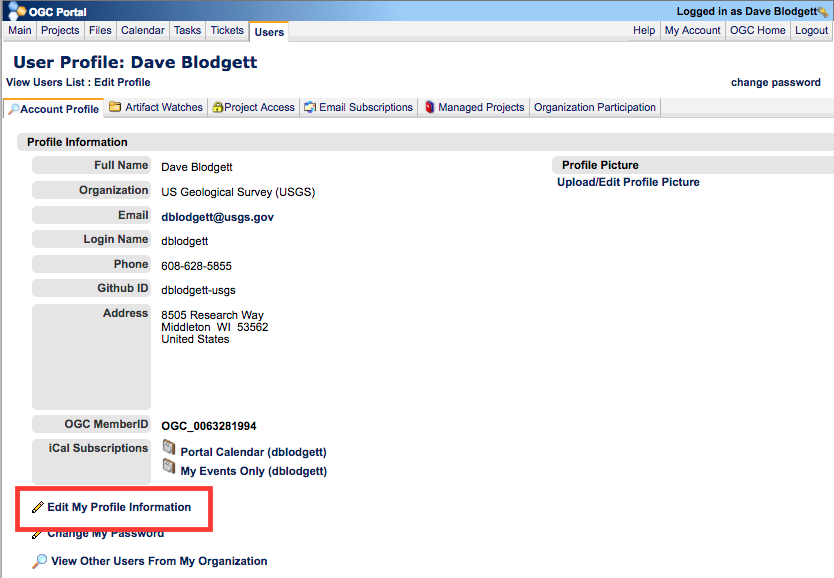
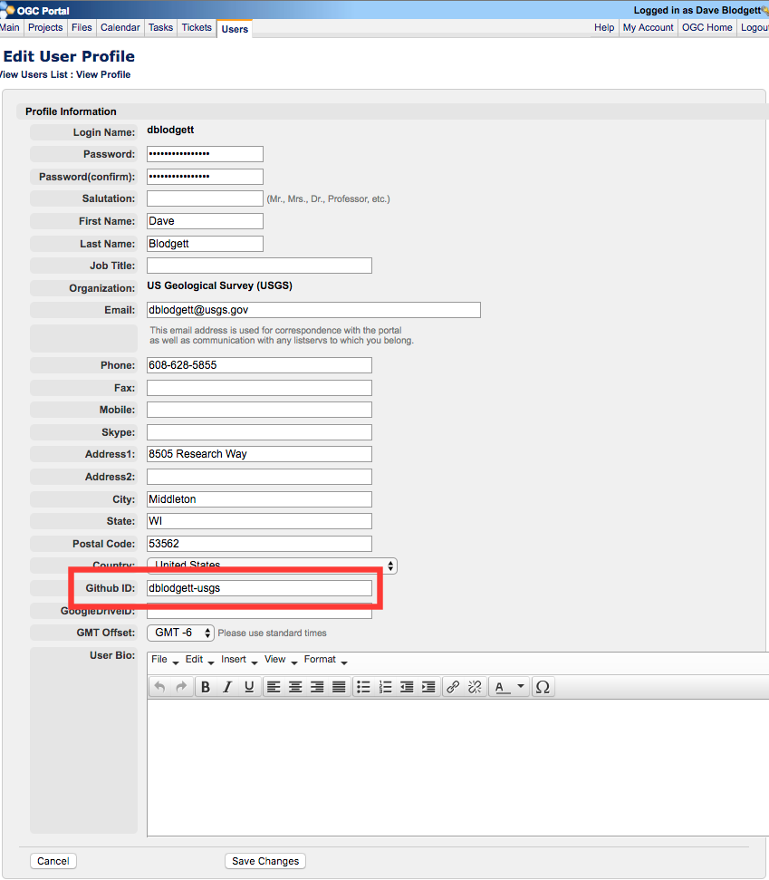
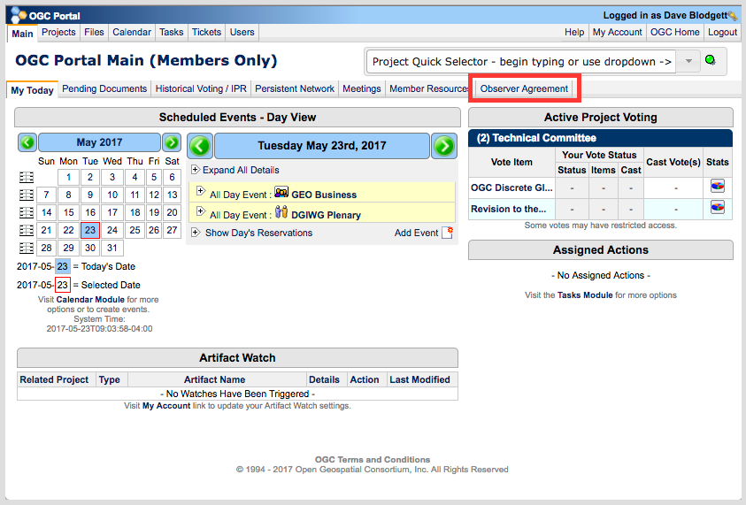
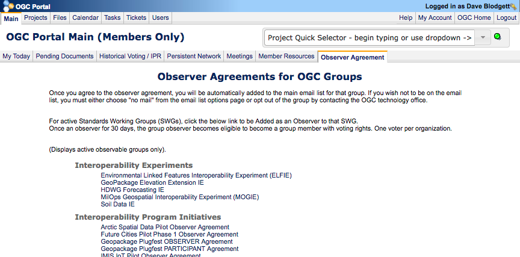
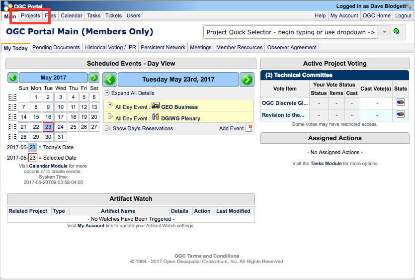
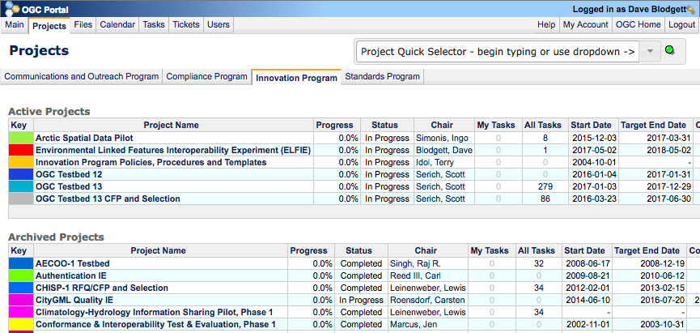

## OGC Portal Setup for GitHub

This brief how to guides you through using the OGC Portal to get access to the ELFIE GitHub repository.

1. Log in to the [OGC Portal.](https://portal.opengeospatial.org/)  
2. First make sure that your github id ([you have a github id, right?](https://github.com/join)) is attached to your OGC portal account. To do this, go into your account settings at the "My Account" link showed with a red box in the image above.  

  

---  

3. On your account page, go to the "Edit My Profile Information" link shown in the image above.  

  

---  

4. Toward the bottom of your account settings, enter your github id in the GitHub ID field. If you go to your github user page, your id is what's after "github.com" in the url. e.g. [https://github.com/dblodgett-usgs](https://github.com/dblodgett-usgs) is the dblodgett-usgs profile page.  
__Remember to "Save Changes" at the bottom of the page!__  

  

---  

5. If you haven't already, please sign the observer agreement. It is available pack on the portal home page by clicking the highlighted link in the image above.  

You'll see the ELFIE link at the top of the list.  
  

---  

6. Now we need to go to the ELFIE Project Page. To find it go to the "Projects" link on the portal home page.  

Then go to the "Innovation Program Tab" You'll see ELFIE in the Active Projects section.  
  

---  

7. On the ELFIE Project Page, assuming you have added your github id to your profile as shown above, you will be able to click "Opt In" where the image above shows "Opt Out". This will give you access to the [ELFIE Github Repository.](http://www.github.com//opengeospatial/ELFIE)  

  
---

__Congratulations!__  
If that last link worked for you, you have access to the ELFIE GitHub repository where this web page is hosted and we will organize most if not all our work on the project. We'll make use of the [project's wiki](https://github.com/opengeospatial/ELFIE/wiki/Activity-Plan), [issues](https://github.com/opengeospatial/ELFIE/issues), [pull requests](https://github.com/opengeospatial/ELFIE/pulls), [projects](https://github.com/opengeospatial/ELFIE/projects), and the github pages web page hosting used for this page!
