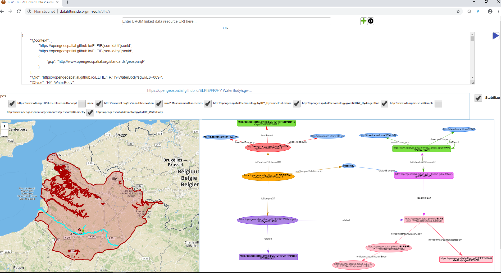

[[Use_Cases]]
== Use Case Summary

=== Introduction
The design phase of the ELFIE focused on identification of a number of use cases with extensive need for linked environmental data. These use cases focused on known difficulties of the systems the ELFIE participants maintain or depend on as users. Many of these use cases were used for the discovery and vetting of ideas only.  Others were further developed with implementation of example encoded linked data and client code to produce desired results of the use case.

Test cases that were implemented as demonstrations of the design outcomes are described below in full detail to include notional diagrams of how datasets involved link to each other, a thorough description of the use case, and an example application that speaks to and/or satisfies the needs of the use case.

The full suite of use cases considered during the design phase of the project are described in the <<use_case_data>> appendix. Each use case takes the form of a simple description of who or what system has an interest in what related datasets. Specific datasets are listed to clarify the scope and provide a starting point for future technical design work. 

=== Test Cases Implemented as Demonstrations of Outcomes

**Water budget summary** This use case provides a person interested in a basic summary of the water budget for a given watershed information about a collection of watersheds and their water budget data. It links together various hydrographic representations of each watershed as well as observational water budget data and related web resources.

As shown in the <<img_uswb_data>>, the watershed feature (black) is linked to various representations of it or information characterizing it (white). This follows the HY_Features HY_Catchment concept (Watershed in figure 1) as an unrealized feature that is related to various realization features, there is no canonical representation of the watershed itself.

[#img_uswb_data,reftext='{figure-caption} {counter:figure-num}']
.Notional diagram of relationships between watershed feature (black) and linked representations and water budget data (white) in the water budget summary use case.
image::images/uswb.png[width=600,align="center"]

Additional details about the water budget summary use case implementation is
available on the
https://opengeospatial.github.io/ELFIE/demo/uswb[demonstration ELFIE web
page.]

**Flood risks and impacts** This use case provides a decision maker needing to respond to flooded transportation infrastructure the information they need to understand the impacted assets and flooded roads for a forecast flood. Under this use case, a flood forecasting system would be able to discover vulnerable infrastructure and assets published by local jurisdictions as linked data and publish flood forecasts that include potentially impacted features in forecast information products.

[#img_floodcast,reftext='{figure-caption} {counter:figure-num}']
.Notional diagram of features (black) and linked data (white) in the floodcast use case. Note that many more relationships could be expressed if desired.
image::images/floodcast.png[width=600,align="center"]

Additional details about the flood risk use case implementation is
available on the
https://opengeospatial.github.io/ELFIE/demo/floodcast[demonstration ELFIE web
page.]

**Ground water level monitoring** This use case is meant to demonstrate how from a given well URI any user (domain expert, machine) can then traverse to the monitoring strategy deployed (piezometer information etc.) and then access ground water level time series and/or information about the monitored aquifer. 

[#img_groundwater_monitoring_data,reftext='{figure-caption} {counter:figure-num}']
.Notional diagram of features (black) and data (white)  in the ground water level monitoring use case.
image::images/FR_groundwater_monitoring.png[width=450,align="center"]

Additional details about the ground water level monitoring use case implementation is available on the
https://opengeospatial.github.io/ELFIE/demo/groundwater_monitoring[demonstration
ELFIE web page.]

**Surface-ground water networks interaction** This use case is meant to demonstrate how from a given Piezometer URI any user (domain expert, machine) can traverse to the ground water monitoring strategy (see Ground water level monitoring Use Case) but also to the associated surface water monitoring one. Provided each surface/groundwater feature is properly linked together (River network, Aquifer system) it is then feasible to discover information about the full, comprehensive water system. This use case can be seen as a flagship demonstrating the usefulness of linked data in the environnemental/cross-domain context.

[#img_surface_groundwater_networks,reftext='{figure-caption} {counter:figure-num}']
.Notional diagram of features (black) and linked observational data (white) in the surface-ground water networks interaction use case.
image::images/FR_surface_ground_surface_roundtrip.png[width=750,align="center"]

Additional details about the surface-ground water networks interaction use case implementation is available on the https://opengeospatial.github.io/ELFIE/demo/surface_groundwater_network_interaction[demonstration ELFIE web page.]

**Watershed data index** This use case is meant to demonstrate the use of HY_Features to link a catchment to the data representing it as well as the monitoring network associated with it. It serves as a general demonstration that could be used for a wide array of linked watershed information use cases.

[#img_huc12obs_data,reftext='{figure-caption} {counter:figure-num}']
.Notional diagram of relationships between the features (black) and linked data (white) in the watershed data index use case.
image::images/us_huc12_obs.png[width=600,align="center"]

Additional details about the watershed data index use case implementation is
available on the
https://opengeospatial.github.io/ELFIE/demo/huc12obs[demonstration ELFIE web
page.]

=== Watershed Data Index Use Case in Depth

This use case is introduced in more detail than those above and its technical details are presented below. Technical details of other use cases can be found at the 
https://opengeospatial.github.io/ELFIE/[ELFIE demonstration web
page.]

The watershed data index use case is focused on a single HY_Catchment feature with an identifier of "070900020601" from the U.S. watershed boundary dataset. Given that HY_Catchment is an unrealized featuretype, the document describing https://opengeospatial.github.io/ELFIE/usgs/huc/huc12obs/070900020601["070900020601"] links to realizations of "070900020601".  Three catchment realizations are included: 

. the https://opengeospatial.github.io/ELFIE/usgs/hucboundary/huc12obs/070900020601[boundary] polygon from the watershed boundary dataset, 
. the https://opengeospatial.github.io/ELFIE/usgs/nhdplusflowline/huc12obs/070900020601[hydrographic] network from the National Hydrography Dataset, 
. and the https://opengeospatial.github.io/ELFIE/usgs/hydrometricnetwork/huc12obs/070900020601[hydrometric] network, a collection of monitoring sites in the catchment.

A more complete implementation could include multiple versions of any of these feature types as well as additional realization types such as a network of channels, or a network of sub-catchments. The boundary polygon and hydrographic network are geospatial features that only link back to the catchment they realize. The hydrometric network is a more complex feature that aggregates a set of network stations, each of type HY_HydrometricFeature.

[#img_huc12obs_screenshot,reftext='{figure-caption} {counter:figure-num}']
.Screenshot of watershed data index use case.
image::images/huc12obs_screenshot.png[width=600,align="center"]

=== Surface-ground water networks interaction Use Case in Depth

This use case is introduced in more detail than those above and its technical details are presented below as it makes intensive use of linked data technologies.

The Surface-ground water networks interaction use case is focused on a single Piezometer with an identifier from the French Ground Water Information Network (00463X0036-H1.2). From its JSON-LD description it is possible to dereference URIs of observations, the monitored Hydrogeounit, and also the associated Stream gage. In hydrological contexts where surface water - groundwater interactions are properly described, groundwater and surface water monitoring stations can be ‘associated’ with correlation coefficients as behaviour of their monitored featured has an impact on the other. The associated Stream gage description is also linked to the river network.

The implementation use case tested during ELFIE allowed traversal of the data graph depicted below. Using a dedicated application it was possible to interact with it: either displaying on maps geographical features or triggering observation display widgets (timeseries).

[#img_sgn_ss_1,reftext='{figure-caption} {counter:figure-num}']
.Screenshot of the surface-ground water networks interaction use case (map visualization data graph traversed).

[#img_sgn_ss_2,reftext='{figure-caption} {counter:figure-num}']
.Screenshot of the surface-ground water networks interaction use case (widget visualisations of dereferenced observations).
image::images/surface_groundwater_networks_screenshot_2.png[width=600,align="center"]